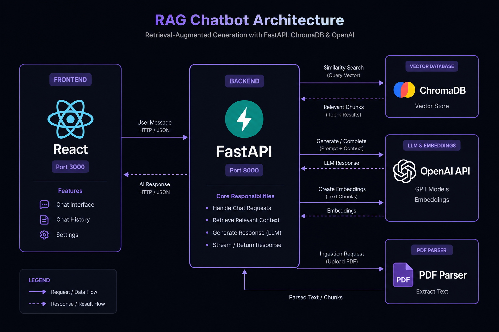

# RAG Chatbot 🤖📄

**Retrieval-Augmented Generation Chatbot** — Upload PDFs, ask questions, get citation-backed answers powered by LangChain + ChromaDB + OpenAI.


---

## 📸 Architecture Diagram



## 🖼️ Screenshots

> 💡 **To capture screenshots:** Run `docker-compose up`, upload a PDF, ask questions, and take screenshots of the chat + upload UI.
> Replace `screenshots/chat.png` and `screenshots/upload.png` with your own captures.

| Chat Interface | Document Upload |
|:---:|:---:|
|  |  |

---

## ✨ Features

- 📤 **PDF Upload & Processing** — Drag-and-drop multiple PDFs; automatic text extraction with page-level tracking
- 🔍 **Semantic Search** — Embeddings via OpenAI `text-embedding-3-small` with ChromaDB vector storage
- 💬 **Streaming Chat** — Real-time token-by-token response streaming via Server-Sent Events (SSE)
- 📎 **Citation-Backed Answers** — Every response cites the exact PDF filename and page number
- 🧠 **Conversation Memory** — Multi-turn conversations with history context
- 🐳 **Docker Compose** — One-command deployment
- ⚡ **FastAPI Backend** — Async Python with LangChain orchestration
- 🎨 **Modern UI** — Dark-themed React frontend with responsive design

---

## 🏗️ Architecture

```
┌─────────────┐     SSE Stream      ┌──────────────┐
│   React UI  │ ◄─────────────────► │   FastAPI     │
│  (port 3000)│     REST API        │  (port 8000)  │
└─────────────┘                     └──────┬───────┘
                                           │
                              ┌────────────┼────────────┐
                              │            │            │
                         ┌────▼───┐  ┌────▼────┐  ┌────▼────┐
                         │ ChromaDB│  │  OpenAI  │  │  PDF    │
                         │ (Vector)│  │  (LLM +  │  │ Parser  │
                         │         │  │ Embed)   │  │         │
                         └─────────┘  └─────────┘  └─────────┘
```

### Data Flow
1. **Upload**: PDF → `pdfplumber` extracts text per page → `RecursiveCharacterTextSplitter` chunks (1000 chars, 200 overlap)
2. **Index**: Chunks → OpenAI Embeddings → Stored in ChromaDB with metadata (filename, page)
3. **Query**: User question → Embedded → Top-5 similar chunks retrieved → Augmented prompt → GPT-4o-mini streamed response
4. **Citations**: Each chunk tracks `source` (filename) + `page` number, displayed as badges in the UI

---

## 🚀 Quick Start

### Prerequisites
- **Docker** & **Docker Compose** (or Python 3.11 + Node.js 20)
- **OpenAI API Key** ([Get one here](https://platform.openai.com/api-keys))

### Option 1: Docker (Recommended)

```bash
# Clone the repo
git clone https://github.com/showab/rag-chatbot.git
cd rag-chatbot

# Set your API key
export OPENAI_API_KEY=sk-your-key-here

# Start everything
docker-compose up --build

# Open http://localhost:3000
```

### Option 2: Manual Setup

#### Backend
```bash
cd backend
python -m venv venv
source venv/bin/activate  # Windows: venv\Scripts\activate
pip install -r requirements.txt

# Create .env file
echo "OPENAI_API_KEY=sk-your-key-here" > .env

# Run
uvicorn app.main:app --reload --port 8000
```

#### Frontend
```bash
cd frontend
npm install
echo "REACT_APP_API_URL=http://localhost:8000" > .env
npm start
```

---

## 📡 API Reference

### `POST /upload`
Upload one or more PDF files.
```
Content-Type: multipart/form-data
Body: file (PDF)
Response: { "message": "...", "chunks": 42, "filename": "doc.pdf" }
```

### `POST /chat`
Send a question, get cited answer.
```json
Request:  { "message": "What is the revenue?", "conversation_id": "optional-uuid" }
Response: { "answer": "...", "sources": [...], "conversation_id": "uuid" }
```

### `POST /chat/stream`
Streaming version of `/chat` via SSE.

### `GET /documents`
List all uploaded documents.

### `DELETE /documents/{filename}`
Remove a document and its embeddings.

---

## 🧪 Testing

```bash
# Backend tests
cd backend
pip install pytest httpx
pytest tests/

# Frontend tests
cd frontend
npm test
```

---

## 📁 Project Structure

```
rag-chatbot/
├── backend/
│   ├── app/
│   │   ├── main.py                  # FastAPI app & routes
│   │   ├── services/
│   │   │   ├── rag.py              # RAG pipeline (LangChain + ChromaDB)
│   │   │   └── document_processor.py # PDF parsing & chunking
│   │   └── models/
│   ├── requirements.txt
│   ├── Dockerfile
│   └── tests/
├── frontend/
│   ├── src/
│   │   ├── App.js                   # Main chat UI + upload
│   │   └── App.css                  # Dark theme styles
│   ├── Dockerfile
│   └── package.json
├── screenshots/
│   └── architecture.png
├── docker-compose.yml
└── README.md
```

---

## 🔧 Configuration

| Variable | Description | Default |
|----------|-------------|---------|
| `OPENAI_API_KEY` | OpenAI API key | Required |
| `REACT_APP_API_URL` | Backend URL for frontend | `http://localhost:8000` |

---

## 🛠️ Tech Stack

| Layer | Technology |
|-------|-----------|
| **LLM** | GPT-4o-mini (OpenAI) |
| **Embeddings** | `text-embedding-3-small` |
| **Vector DB** | ChromaDB |
| **Orchestration** | LangChain |
| **Backend** | FastAPI (Python 3.11) |
| **Frontend** | React 18 |
| **PDF Parsing** | pdfplumber |
| **Containerization** | Docker + Docker Compose |

---

## 🗺️ Roadmap

- [ ] Support for `.docx`, `.txt`, `.md` files
- [ ] Authentication (user-specific document isolation)
- [ ] Conversation management UI (rename, delete threads)
- [ ] Offline embeddings via local models (e.g., `all-MiniLM-L6-v2`)
- [ ] Response caching for repeated queries
- [ ] Deploy to AWS/GCP/Vercel

---

## 📄 License

MIT License — see [LICENSE](LICENSE) file for details.

---

## 🙋‍♂️ Author

**Showab Ahammad** — [GitHub](https://github.com/showab) | [LinkedIn](https://linkedin.com/in/YOUR_PROFILE)

---

⭐ If you found this useful, please star the repo!
